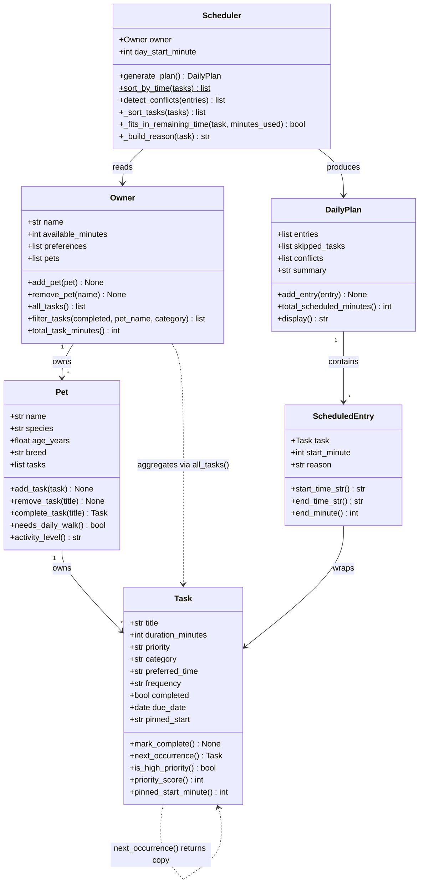

# PawPal+ Project Reflection

## 1. System Design

### Three Core User Actions

1. **Add / manage a pet** – The owner enters basic pet info (name, species, age, breed) so the system can tailor care recommendations to that specific animal.
2. **Add and edit care tasks** – The owner creates tasks such as "morning walk" or "give medication," each with a duration, priority, category, optional preferred time-of-day slot, and an optional pinned clock time.
3. **Generate a daily schedule** – The owner triggers the scheduler, which fits as many tasks as possible into their available time window (sorted by priority) and explains why each task was chosen or skipped.

---

**a. Initial design**

The system uses six classes organised into three layers:

| Class | Layer | Responsibility |
|---|---|---|
| `Task` | Data | Holds what needs to be done, how long it takes, how urgent it is, its recurrence frequency, and an optional locked start time. |
| `Pet` | Data | Describes the animal (species, age, breed), owns its own task list, and handles task completion + next-occurrence generation. |
| `Owner` | Domain | Stores available time and preferences; acts as a registry for Pets; aggregates and filters tasks across all pets. |
| `Scheduler` | Logic | Sorts tasks by time slot / priority, places pinned tasks first, greedily fills remaining budget, and detects interval conflicts. |
| `DailyPlan` | Output | Holds the ordered schedule, skipped tasks, conflict warnings, and a summary string. |
| `ScheduledEntry` | Output | Wraps one Task with its assigned start minute and a human-readable reason string; computes formatted time strings. |

**Relationships:**
- An `Owner` owns one or more `Pet` objects.
- Each `Pet` owns its own `tasks: list[Task]`.
- `Owner.all_tasks()` / `Owner.filter_tasks()` aggregate tasks across all pets for the Scheduler.
- `Scheduler` takes an `Owner`, produces a `DailyPlan` made of `ScheduledEntry` items.

**Final UML class diagram (updated to match implementation):**

**b. Design changes**

Yes — two significant changes happened during implementation:

1. **Tasks moved from Owner to Pet.** The initial skeleton placed tasks on the `Owner`. During Phase 2 I realized tasks logically belong to a specific animal ("Mochi's walk" is not the same as "Luna's walk"), so I moved `tasks: list[Task]` to `Pet` and gave `Pet` the `add_task` / `remove_task` / `complete_task` methods. `Owner` became a pure aggregator via `all_tasks()` and `filter_tasks()`.

2. **`pinned_start` and recurrence were added to `Task`.** The initial design had no concept of clock-pinned tasks or automatic next-occurrence generation. These were added in Phase 3 to support conflict detection and recurring-task automation. Adding `due_date`, `pinned_start`, and `next_occurrence()` to a dataclass was non-breaking (all fields have defaults), which validated the choice to use `@dataclass` from the start.

---

## 2. Scheduling Logic and Tradeoffs

**a. Constraints and priorities**

The scheduler considers three constraints in order:

1. **Completion status** — any task already marked done is excluded entirely before sorting or placing.
2. **Pinned start time** — tasks with a `pinned_start` ("HH:MM") are placed at their exact requested minute regardless of the greedy fill order. This handles medical appointments and classes that have a real-world fixed time.
3. **Available time budget** — unpinned tasks are sorted by priority (high → medium → low), then by preferred time slot (morning → afternoon → evening → none), then by duration (shorter first as a tiebreaker). Tasks are placed greedily until the owner's `available_minutes` is exhausted.

Time budget was chosen as the hardest constraint because it reflects real-world limits the owner cannot change. Priority was the next most important because pet owners care most about safety-critical tasks (medication, feeding) getting done even if time is short.

**b. Tradeoffs**

The scheduler uses **exact interval overlap** (`a.start < b.end AND b.start < a.end`) to detect conflicts, not a fuzzier "same time slot" check. This means two tasks in the same preferred-time slot (e.g., both "morning") without a concrete `pinned_start` are never flagged — only tasks with an explicit clock time can produce a conflict warning.

This tradeoff is intentional. Most pet-care tasks (walks, feedings, grooming) are flexible within a time-of-day window. Flagging every pair of morning tasks as conflicting would produce constant false-positive warnings that train the user to ignore them. The slot-based sort handles the common case elegantly, while pinned-start conflict detection is reserved for the uncommon cases (vet appointments, training classes) where a real clock conflict matters.

---

## 3. AI Collaboration

**a. How you used AI**

AI assistance was used throughout all four phases:

- **Phase 1 (Design):** Used AI to translate a natural-language description of the app into a first-draft Mermaid class diagram. The most effective prompt format was providing the class names and asking "what relationships make sense between these?" rather than asking it to invent the classes from scratch.
- **Phase 2 (Implementation):** Used inline suggestions to fill in method bodies like `_sort_tasks` and `generate_plan`. Asking "how should the Scheduler retrieve all tasks from the Owner's pets?" directly led to the `Owner.all_tasks()` aggregation pattern.
- **Phase 3 (Algorithms):** Used AI to brainstorm the interval-overlap condition for conflict detection and to suggest `dataclasses.replace()` for `next_occurrence()`. Asking "what is the standard interval overlap test?" surfaced the `a.start < b.end AND b.start < a.end` formula immediately.
- **Phase 4 (Testing):** The most useful prompts were "what edge cases would break a greedy scheduler?" — this surfaced the exact-budget-fit, 1-minute-over-budget, and all-tasks-completed scenarios that became `TestEdgeCases`.

**b. Judgment and verification**

During Phase 3, AI initially suggested storing a `next_due: datetime` as a timezone-aware `datetime` object instead of a plain `datetime.date`. The suggestion included `pytz` and timezone-conversion boilerplate. I rejected this because:

1. The app operates entirely within a single day and single time zone — the owner never needs to convert times.
2. Adding `pytz` as a dependency for a feature that doesn't need it would increase setup friction for anyone running the project.
3. A plain `date` + `timedelta` is simpler, more readable, and already covers daily and weekly recurrence completely.

I verified by writing the test `test_next_occurrence_daily_shifts_by_one_day` first (the outcome I wanted), then confirming that `date.today() + timedelta(days=1)` produced exactly that result.

---

## 4. Testing and Verification

**a. What you tested**

The test suite (`tests/test_pawpal.py`, 66 tests, 5 classes) covers:

- **Task lifecycle:** `mark_complete` (happy path, idempotency), `priority_score`, `next_occurrence` (daily, weekly, as-needed, no due-date fallback), `pinned_start_minute` parsing.
- **Pet task management:** Add/remove count invariants, `complete_task` with and without recurrence, no-op on unknown title.
- **Owner aggregation:** `all_tasks` across multiple pets, `filter_tasks` by status / pet name / category / combined, case-insensitive name matching.
- **Scheduler logic:** Priority ordering, time budget enforcement, completed-task exclusion, `sort_by_time` slot order and pinned-minute sub-sort, conflict detection (overlap, adjacent/non-overlap, single task, exact same start).
- **Edge cases:** Empty pets/owners, all tasks done, task that exactly fills budget vs. 1 minute over, `ScheduledEntry` time arithmetic including noon-crossing, `DailyPlan.display()` output, custom `day_start_minute`.

These tests were important because the scheduler's greedy algorithm has several interacting rules (priority, slot, budget, pinned) and a mistake in any one of them could cause high-priority tasks to be skipped or conflicts to go undetected.

**b. Confidence**

**★★★★☆ (4/5).** All core behaviours are verified. The remaining gap is:

- End-to-end Streamlit UI tests (no tool exercises the browser layer).
- Multi-week recurrence chain tests (verifying that daily tasks stay correct over 7+ days).
- Fuzz testing with large task lists to check performance of the O(n²) conflict detector.

---

## 5. Reflection

**a. What went well**

The separation of concerns between layers worked extremely well. Because `Task` and `Pet` are pure `@dataclass` objects with no external dependencies, every unit test is three lines: create the object, call the method, assert. The `Scheduler` only depends on `Owner` (not on Streamlit or I/O), so testing it was equally clean. This architecture also made the Streamlit layer trivial to write — `app.py` is essentially just "call the method, show the result."

**b. What you would improve**

The conflict-detection algorithm is O(n²) — it checks every pair of entries. For a personal pet-care app with 10–20 tasks this is imperceptible, but if the system were extended to manage a kennel with hundreds of pets the quadratic cost would matter. An interval tree (e.g., `sortedcontainers.SortedList`) would reduce conflict detection to O(n log n). I would make this change if the task count regularly exceeded 50.

I would also add a `Pet`-level `available_minutes` so that each animal could have its own energy budget (a puppy might only safely walk 20 min/day regardless of owner time), making the scheduler more medically aware.

**c. Key takeaway**

The most important lesson was that **AI is a fast first drafter, not a final decision-maker.** Every time AI generated a code suggestion, the real work was evaluating whether that suggestion fit the *design constraints* already in place — not just "does it compile?" but "does it belong here, is it the simplest approach, and does it introduce hidden dependencies?" The moments where I overrode an AI suggestion (the `pytz` datetime, the premature abstraction of a shared task helper) produced cleaner code than the AI default. Using separate chat sessions per phase was essential for this — it prevented earlier context from bleeding into later design decisions and forced me to re-state the constraints explicitly each time, which itself clarified my thinking.
