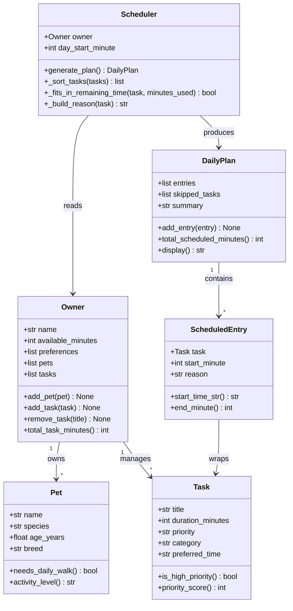

# PawPal+ Project Reflection

## 1. System Design

### Three Core User Actions

1. **Add / manage a pet** – The owner enters basic pet info (name, species, age, breed) so the system can tailor care recommendations to that specific animal.
2. **Add and edit care tasks** – The owner creates tasks such as "morning walk" or "give medication," each with a duration, priority, category, and optional preferred time-of-day slot.
3. **Generate a daily schedule** – The owner triggers the scheduler, which fits as many tasks as possible into their available time window (sorted by priority) and explains why each task was chosen or skipped.

---

**a. Initial design**

The system uses five classes organised into two layers:

| Class | Layer | Responsibility |
|---|---|---|
| `Task` | Data | Holds what needs to be done, how long it takes, and how urgent it is. |
| `Pet` | Data | Describes the animal (species, age, breed) and can infer activity needs. |
| `Owner` | Domain | Stores available time and preferences; acts as a registry for Pets and Tasks. |
| `Scheduler` | Logic | Sorts tasks by priority, greedily assigns start times, and respects the owner's time budget. |
| `DailyPlan` / `ScheduledEntry` | Output | Represents the finished schedule, including skipped tasks and human-readable reasoning. |

**Relationships:**
- An `Owner` owns one or more `Pet` objects and a list of `Task` objects.
- The `Scheduler` takes an `Owner` (and therefore implicitly the pet list and task list) and produces a `DailyPlan`.
- A `DailyPlan` is made of `ScheduledEntry` items, each wrapping a `Task` with a start time and a reason string.

**UML class diagram (Mermaid):**

**b. Design changes**

- Did your design change during implementation?
- If yes, describe at least one change and why you made it.

---

## 2. Scheduling Logic and Tradeoffs

**a. Constraints and priorities**

- What constraints does your scheduler consider (for example: time, priority, preferences)?
- How did you decide which constraints mattered most?

**b. Tradeoffs**

The scheduler uses **exact interval overlap** (`a.start < b.end AND b.start < a.end`) to detect conflicts, not a fuzzier "same time slot" check. This means two tasks pinned to "morning" without a concrete start time are never flagged as conflicting — only tasks with an explicit `pinned_start` in "HH:MM" format can trigger a warning.

This tradeoff is intentional and reasonable for a personal pet-care app. Most tasks (walks, feedings, grooming) are flexible; only medical appointments or classes genuinely need a fixed clock time. Flagging every pair of morning tasks as conflicting would produce false positives that annoy users rather than help them. The slot-based sort handles the common case, while pinned-start conflict detection handles the exceptional cases that actually need it.

---

## 3. AI Collaboration

**a. How you used AI**

- How did you use AI tools during this project (for example: design brainstorming, debugging, refactoring)?
- What kinds of prompts or questions were most helpful?

**b. Judgment and verification**

- Describe one moment where you did not accept an AI suggestion as-is.
- How did you evaluate or verify what the AI suggested?

---

## 4. Testing and Verification

**a. What you tested**

- What behaviors did you test?
- Why were these tests important?

**b. Confidence**

- How confident are you that your scheduler works correctly?
- What edge cases would you test next if you had more time?

---

## 5. Reflection

**a. What went well**

- What part of this project are you most satisfied with?

**b. What you would improve**

- If you had another iteration, what would you improve or redesign?

**c. Key takeaway**

- What is one important thing you learned about designing systems or working with AI on this project?
